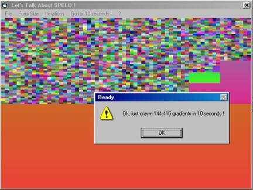



## Let's Talk About SPEED\!  A VERY fast gradient sub  by Light Templer and Carles P\.V\. UPDATE 02/01/05

### Description

A small competition ;) : This should be the fastest gradient sub in VB running from Win95 to Win XP. A small iterative shell arround shows VB's power on your machine. It draws a gradients with ramdom colors onto client area and subdivide into four equal parts. Repeat. This way we get a mix of larger and smaller gradients. Its amazing how many gradients VB can draw even uncompiled in ten seconds. Have fun ;) ! 

----

Regards - LiTe 

----

(Please comment and vote if you like it. Thank you.) 

----

UPDATE 1 : Carles P.V. 's solution beats all! Got upto 7 times! faster results (879500 gradients in ten seconds ... !). His code is elegantly and charming - plz look at it!

----

UPDATE 2 - 12/15/04: (FINAL VERSION - hope so ;) ) Some bug fixing in code and demo (implementing the suggestions from the thread here) and new (tricky) intro screen.

----

UPDATE 3 - 02/01/2005: Bugfix for X size and speed improvement ... ;)
 
### More Info
 

             |
---                |---
**Submitted On**   |2005-02-01 13:00:02
**By**             |[Light Templer](https://github.com/Planet-Source-Code/PSCIndex/blob/master/ByAuthor/light-templer.md)
**Level**          |Advanced
**User Rating**    |4.9 (89 globes from 18 users)
**Compatibility**  |VB 4\.0 \(32\-bit\), VB 5\.0, VB 6\.0
**Category**       |[Graphics](https://github.com/Planet-Source-Code/PSCIndex/blob/master/ByCategory/graphics__1-46.md)
**World**          |[Visual Basic](https://github.com/Planet-Source-Code/PSCIndex/blob/master/ByWorld/visual-basic.md)
**Archive File**   |[Let's\_Talk184669212005\.zip](https://github.com/Planet-Source-Code/light-templer-let-s-talk-about-speed-a-very-fast-gradient-sub-by-light-templer-and-carles-__1-57192/archive/master.zip)

